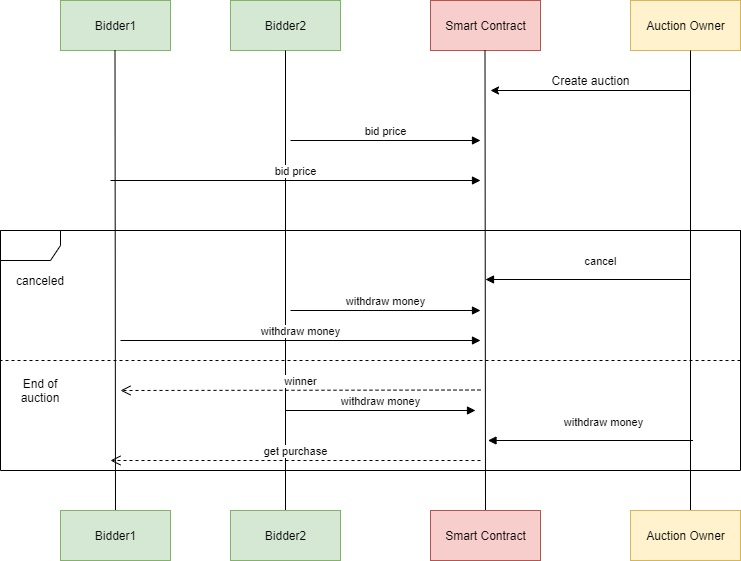

# Ethereum

## Verslo modelis

###### Verslo modelyje dalyvauja dvi šalys: pardavėjas(aukciono savininkas) ir aukciono dalyviai. Aukciono veikimo principas:
1. Pardavėjas sukuria aukcijoną nustatydamas jo vykimo trukmę ir pradinę kainą.
2. Aukciono dalyviai stato pasirinktas sumas.
3. Kol nepasibaigė aukciono laikas, pardavėjas gali atšaukti aukcioną, tuo atveju:
    a) Pardavėjas nebegali atlikti jokių veiksmų
    b) Pirkėjai atsiima savo statytas sumas
4. Kai pasibaigia aukciono laikas, niekas statyti sumų nebegali ir tolesni veiksmai yra:
    a) Pardavėjas išsitraukia laimėtojo sumą
    b) Pralaimėtojai susigražina statytas sumas
