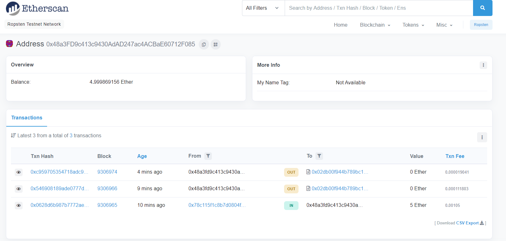
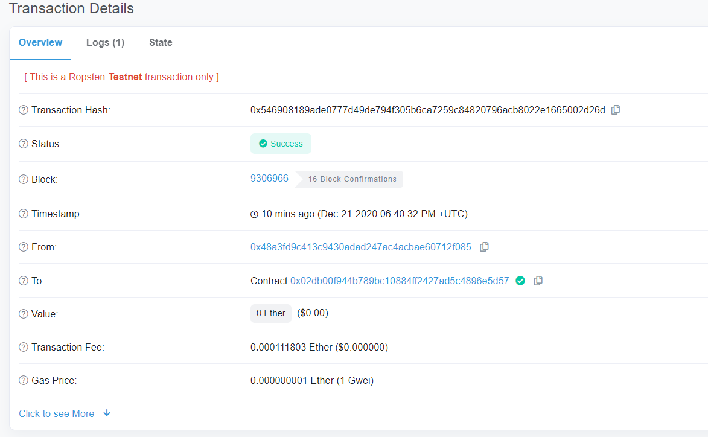

# Ethereum

## Verslo modelis

##### Verslo modelyje dalyvauja dvi šalys: pardavėjas(aukciono savininkas) ir aukciono dalyviai. Aukciono veikimo principas:
1. Pardavėjas sukuria aukcijoną nustatydamas jo vykimo trukmę ir pradinę kainą.
2. Aukciono dalyviai stato pasirinktas sumas.
3. Kol nepasibaigė aukciono laikas, pardavėjas gali atšaukti aukcioną, tuo atveju:
    - Pardavėjas nebegali atlikti jokių veiksmų
    - Pirkėjai atsiima savo statytas sumas
4. Kai pasibaigia aukciono laikas, niekas statyti sumų nebegali ir tolesni veiksmai yra:
    - Pardavėjas išsitraukia laimėtojo sumą
    - Pralaimėtojai susigražina statytas sumas
    
#### Įgyvendinimas
1. Kontraktas kurtas ir testuotas Remix IDE
2. Diegimui ir testavimui naudotas Truffle IDE
3. Sukūrimui ir testavimui lokaliame tinkle naudotas Ganache 
4. Sąsajos įgalinimui su Ethereum tinklu naudotas metamask
5. Testavimui testiniame tinkle naudojau Ropstan

#### Testavimas Ropstan
1. Metamask'e pasirinkau Ropstan tinklą
2. Atsisiunčiau testinių ether'ių iš https://faucet.dimensions.network/
3. Remix'e environment pasirinkau Injected Web3
4. Atlikau transakcijas

#### Paleidimas
1. truffle migrate --reset
2. npm run dev

